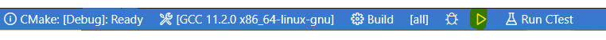
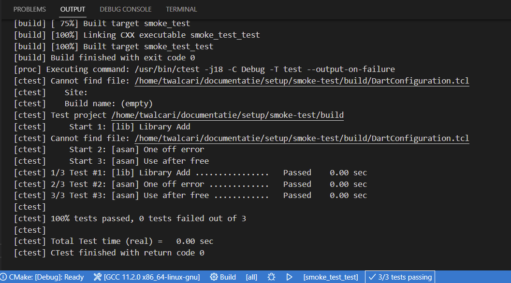

# Setup Gevorderde Algoritmen Toolchain op Mac

:warning: Ondersteuning voor macOS is best-effort. Er zijn gekende problemen met de tools 
die we gebruiken om automatisch *memory leaks* op te sporen (zoals de *AddressSanitizer*).

Indien je problemen ondervindt, overweeg dan om met behulp van [VirtualBox](https://www.virtualbox.org/wiki/Downloads) 
een Ubuntu 22.04-VM aan te maken.


## Installatie

1. Installeer de [Homebrew package manager](https://brew.sh)

2. Installeer de GCC Toolchain, CMake en andere dependencies die we in deze cursus zullen gebruiken:

   ```bash
   brew install cmake gcc@11
   ```

3. Configureer *git* met je naam en emailadres

   ```bash
   # Run this with the correct email and name
   git config --global user.email "you@example.com"
   git config --global user.name "Your Name"
   ```

4. Installeer [Visual Studio Code (VSCode)](https://code.visualstudio.com/)

   ```bash
   sudo snap install --classic code
   ```

5. Voeg *Visual Studio Code* toe aan het PATH van je besturingssysteem. Start hiervoor VSCode, druk 
   <kbd>cmd</kbd> + <kbd>shift</kbd> + <kbd>p</kbd> en zoek naar `>Shell Command: Install 'code' command in PATH`.
   Herstart vervolgens je terminal om het `code` commando beschikbaar te maken.

6. Installeer de `C/C++`, `CMake` en `Live Share` extensies:

   ```bash
   # Noot: herstart je machine indien het `code` commando nog niet beschikbaar is
   code --install-extension ms-vscode.cpptools-extension-pack
   ```

## Verificatie


1. We gaan je setup testen aan de hand van onze *smoke test*. Deze kan je met behulp van volgende commando's downloaden 
   en openen in VSCode:

   ```bash
   git clone https://github.ugent.be/GevAl/documentatie.git
   cd documentatie/setup/smoke-test
   code .
   ```

   Wanneer `git` om een gebruikersnaam en wachtwoord vraagt, geef dan je UGent login-gegevens in.
   
2. De CMake-extensie van VSCode zoekt automatisch naar de beschikbare compilers op je machine. Selecteer *GCC 9.3.0* uit de lijst.

   

3. Compileer en start het programma `smoke_test` door op het :arrow_forward: icoontje te duwen in de balk onderaan:

   

4. Als alles goed gaat, dan zie volgende output:

   

5. De *smoke test* bevat ook een korte testsuite (te vinden in `test/test.cpp`). Je kan deze tests starten door *Run CTest* te drukken:

   

6. Een successvolle uitvoering ziet er als volgt uit:

   
