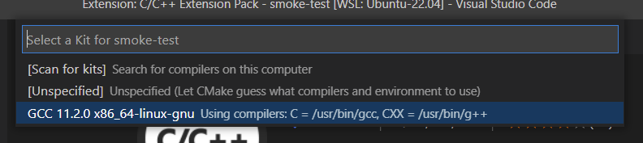
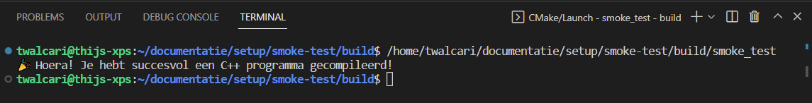

# Setup Gevorderde Algoritmen Toolchain op Windows

We maken gebruik van Windows Subsystem For Linux om Ubuntu 22.04 te draaien op Windows.

## Installatie van WSL2 en Ubuntu 22.04

1. Gebruik de volgende gids om WSL2 te installeren en configureren op Windows:
   [Install Linux on Windows with WSL](https://learn.microsoft.com/en-us/windows/wsl/install).
   Herstart je machine om de installatie te voltooien

2. Installeer [Ubuntu 22.04 LTS](https://www.microsoft.com/store/productId/9PN20MSR04DW) uit de Microsoft Store

3. Start Ubuntu via het startmenu

4. Kies een gebruikersnaam en wachtwoord

5. Rechtsklik op een leeg deel van de titelbalk en selecteer "Properties"

6. Selecteer de optie "Use Ctrl+Shift+C/V as Copy/Paste" en bevestig met "OK"


## Installatie van Visual Studio Code

1. Installeer [Visual Studio Code (VSCode)] op *Windows*

2. Start VSCode en installeer de extensie "Remote - WSL"

## Installeer de C++ development tools op Ubuntu

1. Zorg ervoor dat alle bestaande software up-to-date is

   ```bash
   sudo apt update; sudo apt upgrade
   ```

   > :warning: Indien je netwerk problemen hebt in WSL, dan is je Anti-virus/Firewall vaak de oorzaak. 
   > *Kaspersky*, *AVG* en *Avast* blokkeren soms de toegang van WSL naar het internet.
   >  Pas de configuratie van je beveiligingssoftware aan, of start over op *Windows Defender*.
   > 
   > Als je nog steeds netwerkproblemen hebt, controleer dan of de DNS-instellingen in het bestand 
   > `/etc/resolv.conf` de DNS-servers van je computer bevatten. Indien dat niet het geval is, pas het bestand dan aan:
   >
   > ```shell
   > # This file was automatically generated by WSL. To stop automatic generation of this file, remove this line.
   > nameserver 8.8.8.8
   > nameserver 8.8.4.4
   > ```

2. Installeer de GCC Toolchain, CMake en andere dependencies die we in deze cursus zullen gebruiken:

   ```bash
   sudo apt install build-essential pkg-config cmake gdb git
   ```

3. Configureer *git* met je naam en emailadres

   ```bash
   # Run this with the correct email and name
   git config --global user.email "you@example.com"
   git config --global user.name "Your Name"
   ```

## Configureer VSCode

1. We gaan je setup testen aan de hand van onze *smoke test*. Deze kan je met behulp van volgende commando's downloaden 
   en openen in VSCode:

   ```bash
   git clone https://github.ugent.be/GevAl/documentatie.git
   cd documentatie/setup/smoke-test
   code .
   ```

   Wanneer `git` om een gebruikersnaam en wachtwoord vraagt, geef dan je UGent login-gegevens in.

   Door VSCode te starten via `code` in de Ubuntu Shell zal de "Remote - WSL" automatisch verbinden met de Ubuntu-installatie in WSL.
   Je kan dit verifiëren door in de linkeronderhoek te kijken naar de aanduiding in het groen "WSL: Ubuntu".

   Indien je deze aanduiding niet kan zien, controleer dan of de "Remote - WSL" extensie correct geinstalleerd is, en of je het
   _code-workspace_ opende vanaf de **Ubuntu Shell**

   

2. Installeer de volgende extensie om ondersteuning voor C++ en CMake toe te voegen aan VSCode:

   - `ms-vscode.cpptools-extension-pack` : C/C++ Extension Pack
   
3. Na het *reloaden* van VSCode zal CMake automatisch zoeken naar compilers om te gebruiken. Selecteer *GCC 9.3.0* uit de lijst.

   

4. Compileer en start het programma `smoke_test` door op het :arrow_forward: icoontje te duwen in de balk onderaan:

   

6. Als alles goed gaat, dan zie volgende output:

   

7. De *smoke test* bevat ook een korte testsuite (te vinden in `test/test.cpp`). Je kan deze tests starten door *Run CTest* te drukken:

   

8. Een successvolle uitvoering ziet er als volgt uit:

   
